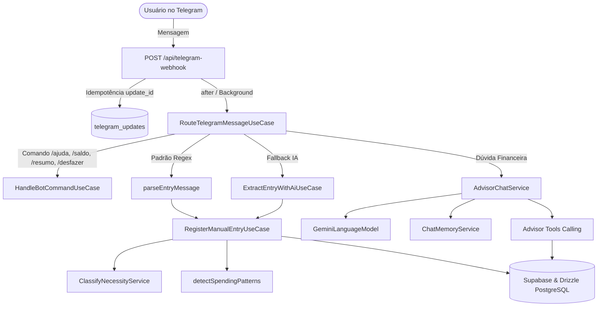

# Relatório Técnico: Lançamentos Manuais via Telegram & IA Consultora Financeira

## 1. Visão Geral e Arquitetura

Este documento detalha todas as alterações arquiteturais, de banco de dados e de código implementadas no projeto **Finance Manager** para substituir a integração com **Pluggy (Open Finance)** por um sistema ágil de **lançamentos manuais via Telegram** potencializado por **Inteligência Artificial (Gemini 2.5)**.



---

## 2. Remoção Completa do Pluggy Open Finance

### Motivação
A integração anterior dependia de sincronizações bancárias via Open Finance (Pluggy), que apresentavam desconexões frequentes de tokens, latência na atualização de transações e custos recorrentes de API por conexão ativa.

### Ações Executadas no Código:
1. **Desinstalação de Pacotes**:
   - `pluggy-sdk` e `react-pluggy-connect` removidos de `package.json` e `pnpm-lock.yaml`.
2. **Exclusão de Módulos e Rotas**:
   - Deletados `src/lib/pluggy.ts`, `src/lib/pluggy-types.ts`, `src/lib/bank-names.ts`.
   - Removidas rotas `src/app/api/pluggy/*`, rotas de webhook e sincronização cron.
   - Deletada página `src/app/connections/` e componentes `src/components/connections/*`.
3. **Limpeza de UI e Navegação**:
   - `Navigation.tsx`: Removido link do menu "Conexões".
   - `HeaderControls.tsx`: Removido botão e modal de "Adicionar Conexão".
   - `settings/page.tsx`: Removido card de status de Open Finance.
4. **Camada de Dados Independente de APIs Externas**:
   - Criados serviços diretos de consulta sobre PostgreSQL/Supabase:
     - `overview-data-service.ts`: Consolida totais bancários, cartões e investimentos direto do banco.
     - `movements-data-service.ts`: Totaliza despesas e receitas por período.
     - `assets-data-service.ts`: Consolida portfólio de investimentos.
     - `search-transactions-service.ts`: Busca textual de transações.

---

## 3. Banco de Dados e Migrações (Supabase / Drizzle)

### Arquivo de Migração: `supabase/migrations/0006_manual_ai_telegram.sql`

```sql
-- 1. Identificação de Origem e Necessidade em Transações
ALTER TABLE transactions
  ADD COLUMN IF NOT EXISTS source text NOT NULL DEFAULT 'manual',
  ADD COLUMN IF NOT EXISTS necessity text;

-- 2. Histórico de Conversas do Chatbot Telegram
CREATE TABLE IF NOT EXISTS chat_messages (
  id uuid PRIMARY KEY DEFAULT gen_random_uuid(),
  user_id uuid NOT NULL REFERENCES users(id) ON DELETE CASCADE,
  role text NOT NULL CHECK (role IN ('user', 'assistant', 'system')),
  content text NOT NULL,
  created_at timestamptz NOT NULL DEFAULT now()
);

-- 3. Memória de Fatos e Preferências de Longo Prazo da IA
CREATE TABLE IF NOT EXISTS assistant_memory (
  id uuid PRIMARY KEY DEFAULT gen_random_uuid(),
  user_id uuid NOT NULL REFERENCES users(id) ON DELETE CASCADE,
  fact text NOT NULL,
  created_at timestamptz NOT NULL DEFAULT now()
);

-- 4. Tabela de Idempotência do Webhook do Telegram
CREATE TABLE IF NOT EXISTS telegram_updates (
  update_id bigint PRIMARY KEY,
  processed_at timestamptz NOT NULL DEFAULT now()
);
```

### Repositórios Atualizados:
- `SupabaseTransactionRepository`:
  - Suporte a filtros por `source: 'manual'`, ordenação, paginação e exclusão atômica (`delete(id)`).
  - Consulta do último registro via `findLatestByUserId(userId)`.
- `DrizzleIncomeRepository` e `DrizzleInvestmentRepository`:
  - Implementados métodos `create()`, `findLatestByUserId()` e `delete()`.

---

## 4. Parsers, Heurísticas e Detecção de Padrões

### 1. Parser Determinístico de Mensagens (`parse-entry-message.ts`)
Identifica padrões comuns digitados pelo usuário no chat do Telegram sem latência de IA:
- **Despesas**:
  - `almoço 35` -> Categoria `Alimentação`, Descrição `almoço`, Valor `35.00`
  - `-50 uber` -> Categoria `Transporte`, Descrição `uber`, Valor `50.00`
  - `mercado 120,50` -> Categoria `Mercado`, Descrição `mercado`, Valor `120.50`
- **Entradas**:
  - `recebi 1500 freela` -> Categoria `Renda Extra`, Tipo `income`, Valor `1500.00`
  - `salario 5000` -> Categoria `Salário`, Tipo `income`, Valor `5000.00`
- **Investimentos**:
  - `inv 500 cdb` -> Categoria `Renda Fixa`, Tipo `investment`, Valor `500.00`
  - `investi 200 ações petr4` -> Categoria `Ações`, Tipo `investment`, Valor `200.00`

### 2. Fallback com Extração Estruturada por IA (`extract-entry-with-ai.ts`)
Quando a mensagem não atende às expressões regulares do parser, o caso de uso aciona o **Gemini 2.5 Flash** solicitando retorno JSON estrito:
- Se for lançamento financeiro implícito (ex: *"comprei um fone bluetooth por 189 reais no mercado livre"*): extrai tipo, valor, categoria e descrição.
- Se faltar dado crítico (ex: *"comprei um fone ontem"*): retorna `needsClarification: true` e devolve a pergunta para o usuário no Telegram.

### 3. Classificação de Necessidade (`classify-necessity-service.ts`)
Classifica cada gasto em:
- `essencial`: Contas fixas, saúde, mercado básico.
- `importante`: Transporte, ferramentas, educação.
- `superfluo` (antiga "bobeira"): Delivery recorrente, jogos, compras por impulso.
- Otimização com chave de cache composta `${userId}:${category}:${description}` e reaproveitamento do histórico prévio do usuário.

### 4. Detector de Padrões de Gastos (`detect-spending-patterns.ts`)
Analisa os últimos lançamentos do usuário e dispara alertas proativos na confirmação:
- `repeated_small`: Mais de 3 lançamentos <= R$ 60 na mesma categoria (alerta de "gotejamento financeiro").
- `spike_above_average`: Lançamento individual que supera 2x a média habitual daquela categoria.
- `subscription_like`: Valores idênticos repetidos (potencial assinatura não rastreada).
- `near_category_limit`: Gastos acumulados no mês atingindo 80% ou mais da meta cadastrada.

---

## 5. IA Consultora Financeira Pessoal (Gemini 2.5)

### 1. Modelo de Linguagem Abstrato (`GeminiLanguageModel.ts`)
Implementa a interface `ILanguageModel` sobre o Vercel AI SDK (`ai` v7):
- Alternância entre `gemini-3.6-flash` (operações rápidas/parsers) e `gemini-3.1-pro-preview` (análises e resumos semanais profundos).
- Suporte a Tool Calling via `inputSchema` e `stopWhen: isStepCount(...)`.

### 2. Ferramentas do Consultor (Tool Calling)
Divididas por responsabilidade (SRP) abaixo do limite de 100 linhas:
- **Consultas** (`advisor-query-tools.ts`):
  - `buscar_lancamentos`: Histórico de despesas por período ou categoria.
  - `total_por_categoria`: Gasto consolidado por categoria no mês.
  - `comparar_periodos`: Comparação mês a mês entre dois períodos (ex: `2026-09` vs `2026-10`).
- **Ações** (`advisor-action-tools.ts`):
  - `registrar_lancamento`: Cadastra despesa, receita ou investimento diretamente pela fala do usuário.
  - `definir_limite_categoria`: Ajusta a meta orçamentária de uma categoria.
  - `salvar_memoria`: Grava fatos perenes do usuário (ex: *"planejo viajar em dezembro"*, *"tenho 2 filhos"*).

### 3. Memória Deslizante e Contexto (`chat-memory-service.ts`)
- Mantém histórico imediato das últimas 12 mensagens do chat Telegram.
- Ao ultrapassar a janela, mensagens antigas são condensadas em um resumo sintético preservado no prompt do sistema.
- Snapshot financeiro em tempo real calculado em `calculate-financial-snapshot.ts` injetado diretamente no prompt da persona.

---

## 6. Telegram Bot & Webhook Assíncrono

### 1. Webhook Serverless com Next.js `after()` (`telegram-webhook/route.ts`)
- Validação do segredo `x-telegram-bot-api-secret-token`.
- Registro de `update_id` na tabela `telegram_updates`: chamadas duplicadas recebem 200 OK imediatamente sem reprocessamento.
- Utilização de `after()` do Next.js para enviar status HTTP 200 ao Telegram em milissegundos e processar toda a lógica de parsing/LLM em background sem timeout de rede.

### 2. Roteamento Inteligente (`route-telegram-message.ts`)
```text
Mensagem Recebida
  ├── É comando? (/ajuda, /saldo, /resumo, /desfazer, /cancelar) -> Executa HandleBotCommand
  ├── É resposta a prompt de metas ativas? -> Executa RecordGoalsReply
  ├── Corresponde a Regex de lançamento? -> Executa RegisterManualEntry
  ├── Fallback: Extração com IA detectou lançamento? -> Executa RegisterManualEntry
  └── Fallback: Mensagem conversacional? -> Executa AdvisorChatService (Consultoria)
```

### 3. Feedback Visual ao Usuário (`TelegramService.ts`)
- Método `sendTyping()` dispara a ação `typing` na API do Telegram antes de tarefas demoradas do consultor de IA.
- Formatação de confirmação rica em `manual-entry-confirmation-formatter.ts`.

---

## 7. Commits Semânticos Realizados no Branch `feat/manual-ai-telegram`

| Hash | Mensagem | Escopo |
| :--- | :--- | :--- |
| `4a508f7` | `refactor(deps): remove pluggy-sdk and react-pluggy-connect` | Limpeza de dependências externas |
| `5f7c4c0` | `refactor(ui): remove connections page and menu items` | Telas de conexão e navegação |
| `95b96ec` | `refactor(finance): replace pluggy services with database data layer` | Camada de agregação financeira local |
| `e6d6634` | `feat(repositories): add manual source and CRUD methods to transaction and finance repos` | CRUD em repositórios Drizzle/Supabase |
| `9b78399` | `fix(settings): import missing profile and change password forms` | Correção pontual de imports de settings |
| `f7e81cb` | `feat(db): add manual entries, chat messages and memory migration` | Migração SQL 0006 |
| `6acb78b` | `feat(finance): add manual entry parsing, pattern detection and snapshot calculation` | Heurísticas e parsers de lançamentos |
| `1cf30ba` | `feat(finance): add manual entry use case and classify necessity service` | Casos de uso de registro e comandos |
| `2c10387` | `feat(ai): implement Gemini advisor model, memory, tools and chat service` | Consultor Gemini 2.5, tools e memória |
| `a214f5f` | `feat(telegram): implement bot message router, typing indicator and async webhook` | Webhook, roteador e TelegramService |
| `086af54` | `fix(finance): address code review feedback on patterns, queries and tools` | Ajustes do Code Review (setMonth, escopo de cache, etc.) |

---

## 8. Verificação de Qualidade e Conformidade

1. **Zero Comentários**: Nenhum comentário mantido nos arquivos `.ts` e `.tsx` criados ou modificados.
2. **Limite de 100 Linhas por Arquivo**: Todos os 78 arquivos novos/alterados têm <= 100 linhas (inclusive repositórios, cards e ferramentas modularizados).
3. **Tipagem TypeScript Estrita**: `pnpm typecheck` executa sem nenhum erro (`tsc --noEmit` código 0); nenhum tipo `any` utilizado fora de blocos `catch`.
4. **Linter**: `pnpm lint` executado com `--max-warnings=0` e código 0.
5. **Testes Unitários**: 127 testes passando em 26 suítes (`pnpm test`).
6. **Code Review Automatizado**: Executado pelo subagente `code-reviewer`, com resolução e commit de todos os apontamentos de atenção.
7. **Pull Request**: Branch `feat/manual-ai-telegram` enviada ao GitHub remoto com PR [#2](https://github.com/me-lucas-al/finance-manager/pull/2) aberto vinculando e fechando a Issue [#1](https://github.com/me-lucas-al/finance-manager/issues/1).
